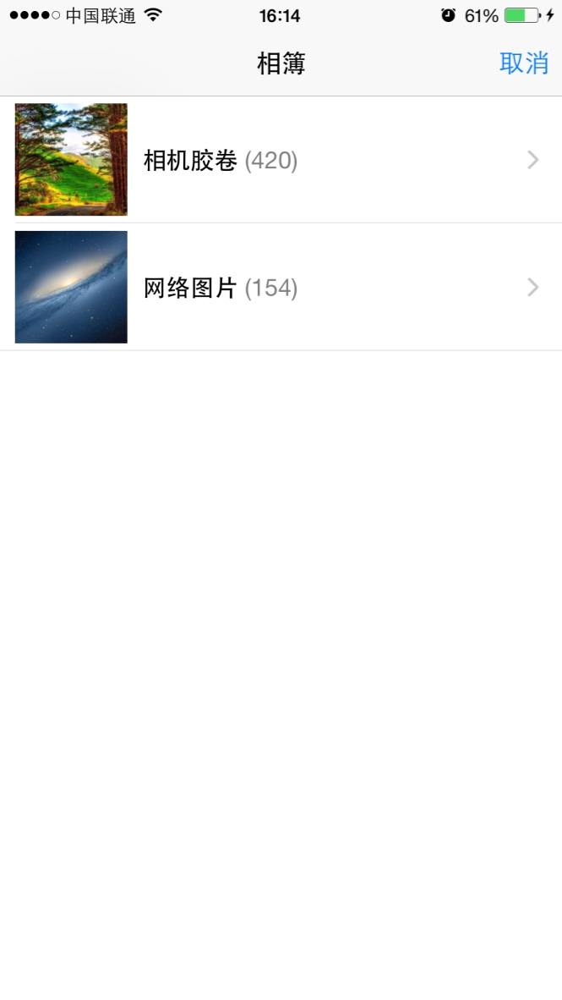

# CTAssetsPicker

从相册选择图片或者视频（ARC），已支持图片的预览（放大），暂不支持视频的播放预览，不支持横竖屏的切换。




### #import "CTAssetsPickerController.h"

```` objective-c
typedef NS_ENUM(NSInteger, CTAssetsPickerControllerAssetsType){ // Assets type
    CTAssetsPickerControllerAssetsTypePhoto, // Photo
    CTAssetsPickerControllerAssetsTypeVideo, // Video
    CTAssetsPickerControllerAssetsTypeAllAsset // Photo and Video
};

@protocol CTAssetsPickerControllerDelegate;

@interface CTAssetsPickerController : UINavigationController

@property (nonatomic, weak) id<UINavigationControllerDelegate, CTAssetsPickerControllerDelegate> delegate;

@property (nonatomic, assign, readonly) CTAssetsPickerControllerAssetsType assetsType; // Default CTAssetsPickerControllerAssetsTypePhoto
@property (nonatomic, strong, readonly) ALAssetsFilter *assetsFilter;
@property (nonatomic, strong, readonly) NSArray *selectedAssets; // selected asset

@property (nonatomic, assign) NSUInteger enableMaximumCount; // Default 0，0 is not limited.
@property (nonatomic, assign) NSUInteger enableMinimumCount; // Default 0，0 is not limited.

@property (nonatomic, assign, getter = isShowEmptyGroups) BOOL showEmptyGroups; // Default NO
@property (nonatomic, assign, getter = isFinishDismissViewController) BOOL finishDismissViewController; // Default YES.

@property (nonatomic, strong, readwrite) UIColor *toolbarItemBackgroundColor; // Assets view bottom toolbar barButtonItem background color.
@property (nonatomic, strong, readwrite) UIColor *toolbarItemFontColor; // Assets view bottom toolbar barButtonItem font color.

- (instancetype)initWithAssetsType:(CTAssetsPickerControllerAssetsType)assetsType;

- (void)deselectAssetAtIndex:(NSUInteger)index; // Cancel select asset at index.

@end

@protocol CTAssetsPickerControllerDelegate <NSObject>

@required
- (void)assetsPickerController:(CTAssetsPickerController *)assetsPickerController didFinishPickingAssets:(NSArray *)assets assetsType:(CTAssetsPickerControllerAssetsType)assetsType;

@optional
- (void)assetsPickerControllerDidCancel:(CTAssetsPickerController *)assetsPickerController;

- (void)assetsPickerController:(CTAssetsPickerController *)assetsPickerController didSelectAsset:(ALAsset *)asset;
- (void)assetsPickerController:(CTAssetsPickerController *)assetsPickerController didDeselectAsset:(ALAsset*)asset;

- (void)assetsPickerController:(CTAssetsPickerController *)assetsPickerController didSelectCountReachedEnableMaximumCount:(NSUInteger)enableMaximumCount;
- (void)assetsPickerController:(CTAssetsPickerController *)assetsPickerController didSelectCountUnderEnableMinimumCount:(NSUInteger)enableMinimumCount;

@end

````

```` objective-c
#import "CTAssetsPickerController.h"

CTAssetsPickerController *assetsPickerController = [[CTAssetsPickerController alloc] initWithAssetsType:CTAssetsPickerControllerAssetsTypeAllAsset];
assetsPickerController.delegate = self;
assetsPickerController.enableMaximumCount = 9;
[self presentViewController:assetsPickerController animated:YES completion:NULL];

- (void)assetsPickerController:(CTAssetsPickerController *)assetsPickerController didFinishPickingAssets:(NSArray *)assets assetsType:(CTAssetsPickerControllerAssetsType)assetsType{
    NSLog(@"%@", NSStringFromSelector(@selector(assetsPickerController:didFinishPickingAssets:assetsType:)));
    switch (assetsType) {
        case CTAssetsPickerControllerAssetsTypePhoto:{

    }
        break;
    case CTAssetsPickerControllerAssetsTypeVideo:{

    }
        break;
    case CTAssetsPickerControllerAssetsTypeAllAsset:{

    }
        break;
    default:
        break;
    }
}

- (void)assetsPickerController:(CTAssetsPickerController *)assetsPickerController didDeselectAsset:(ALAsset *)asset{
    NSLog(@"%@", NSStringFromSelector(@selector(assetsPickerController:didDeselectAsset:)));
}

- (void)assetsPickerController:(CTAssetsPickerController *)assetsPickerController didSelectAsset:(ALAsset *)asset{
    NSLog(@"%@", NSStringFromSelector(@selector(assetsPickerController:didSelectAsset:)));
}

- (void)assetsPickerController:(CTAssetsPickerController *)assetsPickerController didSelectCountReachedEnableMaximumCount:(NSUInteger)enableMaximumCount{
    NSLog(@"%@", NSStringFromSelector(@selector(assetsPickerController:didSelectCountReachedEnableMaximumCount:)));
}

- (void)assetsPickerController:(CTAssetsPickerController *)assetsPickerController didSelectCountUnderEnableMinimumCount:(NSUInteger)enableMinimumCount{
    NSLog(@"%@", NSStringFromSelector(@selector(assetsPickerController:didSelectCountUnderEnableMinimumCount:)));
}

- (void)assetsPickerControllerDidCancel:(CTAssetsPickerController *)assetsPickerController{
    NSLog(@"%@", NSStringFromSelector(@selector(assetsPickerControllerDidCancel:)));
}

````
